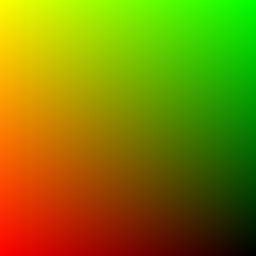
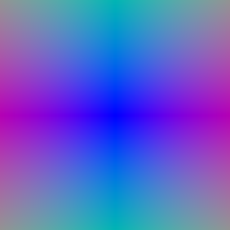
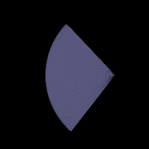
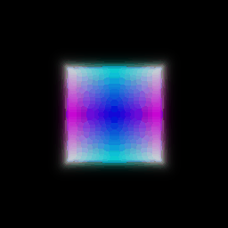
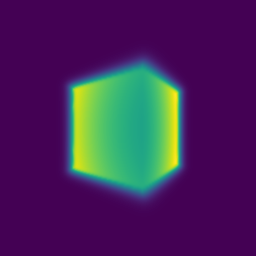
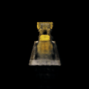
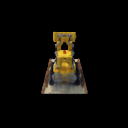
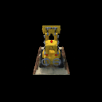
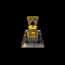

# CMSC848F - Assignment 3: NeRF Rendering
## Authors

|Name|ID|Email|
|:---:|:---:|:---:|
|Shantanu Parab|119347539|sparab@umd.edu|

## Description

This package consist of the code and results for the assignment submission for CMSC848F.

**Open [writeup](/report/writeup.md.html) in a browser to access the writeup webpage.**


**Setup**

- These instruction assume that you have completed all the installation and setup steps requrired.
- To recreate the results in this assignment, download the package and unzip into a folder.
- Move into the package `assignment3_sparab`.

Extract the dataset from [here](https://drive.google.com/drive/folders/1Nc6dS4mNlmFrEpY00BXxwIpHDl1AyXWC?usp=sharing) and move it into the `data` folder. 


# Differentiable Volume Rendering       

- In this section we will define basic functions like ray sampling,point sampling and volue rendering.


## Ray sampling

We imlpement the following two functions

        1. **get_pixels_from_image** in **ray_utils.py** 
        2. **get_rays_from_pixels** in **ray_utils.py**

The **get_pixels_from_image** method generates pixel coordinates, ranging from `[-1, 1]` for each pixel in an image.
 The **get_rays_from_pixels** method generates rays for each pixel, by mapping from a camera's **Normalized Device Coordinate (NDC) Space** into world space.

**Command:**

```bash
python main.py --config-name=box
```


**Visualization**




## Point Sampling

Completed **StratifiedSampler** in sampler.py. 


**Command:**

```bash
python main.py --config-name=box
```


**Visualization**




## Volume Rendering

Implementation of  **VolumeRenderer._compute_weights** and **VolumeRenderer._aggregate**.
Modified **VolumeRenderer.forward** method to render a depth map in addition to color from a volume


**Command:**

```bash
python main.py --config-name=box
```


**Visualization**




# Optimizing a Basic implicit Volume

## Random Ray sampling

Implementation of the get_random_pixels_from_image method in ray_utils.py done here.

##  Loss and training


After optimizing the position and side lengths of a box, given a few ground truth images with known camera poses (in the data folder).
The center of the box, and the side lengths of the box after training, rounded to the nearest 1/100 decimal place are as follows.

**Original Output**

Box center: (0.25013068318367004, 0.25054237246513367, -0.00021909750648774207)

Box side lengths: (2.0048577785491943, 1.5034379959106445, 1.50294029712677)

**Rounded Output**

Box center: (0.25, 0.25, 0.00)

Box side lengths: (2.00, 1.50, 1.50)

**Command:**

```bash
python main.py --config-name=train_box
```


# Optimizing a Neural Radiance Field

**Visualization**

The final rendering output is as follows.


Improvements were observed in the output after each epochs.
To visualize how the ouput improved. Here are some images at every 50 epoch interval.






# References

Inorder to completed the assignment and to understand the code implementation I have used the following References.

Facebook NeRF -> https://github.com/facebookresearch/pytorch3d/tree/main/projects/nerf

Learning 3D Vision CMU -> https://www.andrew.cmu.edu/course/16-825/projects/dkalaria/proj3/
